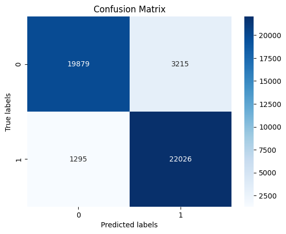
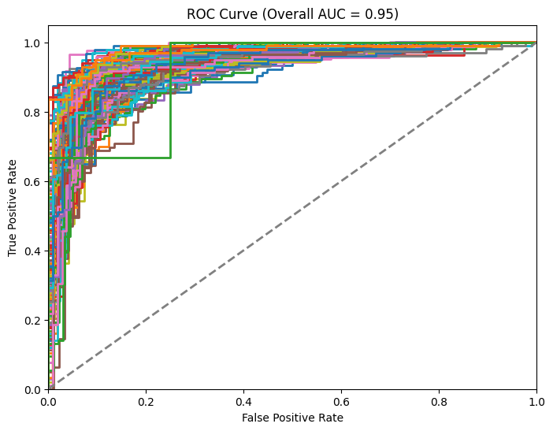
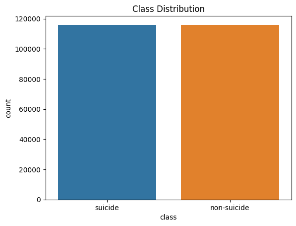
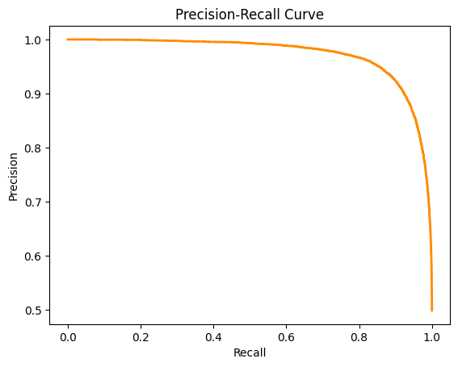
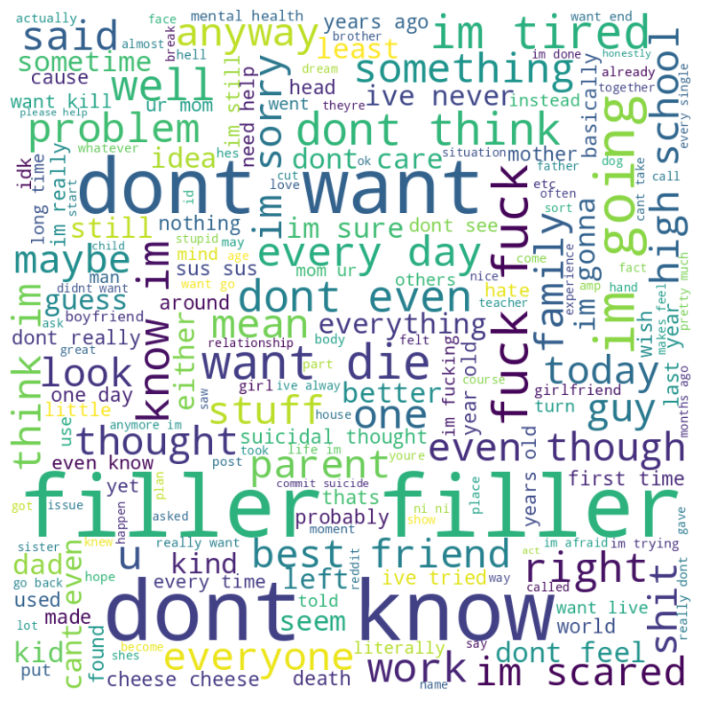

# Mental-Health-Markers-On-Social-Media

## Data Set
Dataset is too large for Github and can be found here:  https://www.kaggle.com/datasets/nikhileswarkomati/suicide-watch

Utilizing the power of machine learning and NLP, this project endeavors to analyze social media data to identify potential markers of psychological disturbances, specifically focusing on content that might indicate suicidal tendencies.

## Table of Contents
- [Introduction](#introduction)
- [Data Description](#data-description)
- [Methodology](#methodology)
- [Results](#results)
- [Visualization Recommendations](#visualization-recommendations)
- [Ethical Considerations](#ethical-considerations)
- [Future Work](#future-work)
- [Contributions](#contributions)
- [Acknowledgments](#acknowledgments)

## Introduction
The increasing global prominence of mental health concerns and the ubiquity of social media platforms combine to offer a unique opportunity. By analyzing the vast textual data available on these platforms, we aim to gain insights into individuals' mental states, potentially leading to early detection of distress signals and timely interventions.

## Data Description
Our dataset comprises 46,415 samples labeled as either 'suicide' or 'non-suicide'. Each sample contains text extracted from various social media platforms. The data features include:

- **text**: The actual textual content from social media posts.
- **class**: A binary label indicating whether the content shows signs of suicidal tendencies.

## Methodology
- **Data Pre-processing**: The data underwent a series of cleaning processes, tokenization, and vectorization, rendering it suitable for machine learning.
- **Modeling**: A binary classification model was developed to segregate the content.
- **Evaluation**: The model's performance was evaluated using various metrics, including accuracy, precision, recall, and the F1 score.
## Results
Our model achieved promising results in preliminary tests:

```
                precision    recall  f1-score   support

    non-suicide       0.94      0.86      0.90     23169
        suicide       0.87      0.95      0.91     23246

       accuracy                           0.90     46415
      macro avg       0.91      0.90      0.90     46415
   weighted avg       0.91      0.90      0.90     46415
```

## Visualization Recommendations
To better understand the model's performance and the data characteristics:


1. **Confusion Matrix**: Displays the number of actual vs. predicted classifications.




2. **ROC-AUC Curve**: Assesses the model's discriminative power between classes.




3. **Feature Importance**: Useful if deploying tree-based models to see which terms or n-grams are most impactful.



4. **Precision**: Visualize the performance of a binary classifier as the discrimination threshold varies

 
  
6. **Word Clouds**: Visualize frequently occurring terms within each class.



 ## Ethical Considerations

 Mental health is a sensitive domain. While our model can be a valuable tool:

- It should not replace professional evaluation.
- User data privacy is paramount; always anonymize and securely store data.
- Obtain informed consent where necessary.

## Future Work
**Model Enhancement**: Further refinement to detect a broader range of mental health issues.

**Data Expansion**: Incorporate emojis, images, and user interactions for a holistic analysis.

**Bias Mitigation**: Evaluate the model for biases and ensure fairness in predictions.

## Contributions
All collaborators and contributors! Please ensure ethical guidelines are adhered to and respect user privacy when suggesting or implementing changes.

## Acknowledgments
- Special thanks to ChatGPT for giving reocomendations on speeding up ROC-AUC curve.
- Special thanks to nikhileswarkomati for providing a Kaggle dataset.
